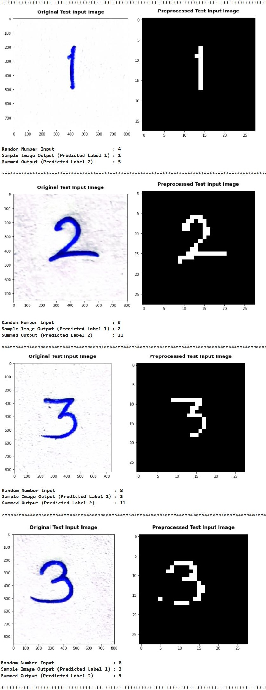

# Multi-Input-Multi-Output-MNIST-Image-Digit-and-Summed-Output-Classification

## 1. Project Overview

### Objective:

To write a neural network that can: 
1. Take 2 inputs: 
● an image from the MNIST dataset (say 5), and 
● a random number between 0 and 9, (say 8) 
and gives two outputs: 
● the "number" that was represented by the MNIST image (predict 5), and 
● the "sum" of this number with the random number and the input image to the network (predict 5 + 8 = 13)  
 
2. Mixing fully connected layers and convolution layers is allowed 
3. Also, it is recommended to used one-hot encoding to represent the random number input as well as the "summed" output 
● Random number (7) can be represented as 0 0 0 0 0 0 0 1 0 0 
● Sum (13) can be represented as: 0 0 0 0 0 0 0 0 0 0 0 0 0 1 0 0 0 0 0 
 

## 2. Project Understanding and Requirements

### 2.1 Understanding the MNIST Digit Image Dataset
The MNIST *(Modified National Institute of Standards and Technology database)* is a large database of handwritten digits that is commonly used for training various image processing systems. It comprises images of handwritten digits, and has a training set of 60,000 examples, and a test set of 10,000 examples. The digits have been size-normalized and centered in a fixed-size image. Please click on this [dataset_link](https://storage.googleapis.com/tensorflow/tf-keras-datasets/mnist.npz) to download the MNIST dataset. 

### 2.2 Understanding the working of expected neural network
A sample neural network could be 
 
**Example:** The expected neural network takes an MNIST digit image having the true label '5' and random number input '7', and returns the classified/predicted image label '5' along with the classified summed output i.e. (sum of predicted number label and random number label -> 5+7=12) 12 label.  

### 2.3 Essential major parts to this problem:

1. **Network Architecture:** This will formulate the above problem statement into code.

2. **Dataset Creation:** In order for the network to work properly i.e. give out the desired kind of the result, it is expected to pass the data in a proper format and also create a ground truth for the training to happen. Also, it is required to use two sets of data namely MNIST and random numbers from 0-9. An apt strategy to combine the two different types of data together needs to employed.

3. **Choice of Loss Function:** This will determine if the training is happening properly or not. The choice of loss function is critical for the network to get trained. Loss function essentially calculates the error which over the course of the training is reduced to as minimal as possible. Multiple loss functions can be
used for the two different kinds of data types (images and numbers).

4. **Evaluation:** The network needs to be tested with a validation set or the data which the network has never seen so that we can determine if the network is overfitted or generalized. (Use the MNIST test data + random number to get the test data)
  

## 3. Solution and its components

### 3.1 Jupiter Notebook
The Jupyter IPython notebook **(MNIST_Image_Classification_and_Summed_Output_Project.ipynb)** contains the necessary code to solve this problem. This notebook highlights the recommended approach that consists of the following stages:
- Data Understanding
- Data Preparation and Manipulation
- Model (Network) Building
- Model Evaluation
- Additional testing of out of the dataset digit image samples and random number inputs

### 3.2 Custom Python Modules
**Four different custom modules are created in python (.py)** to address each aspect of the mentioned problem.
1. Custom Module 1: **'helper_mnist.py'**: *Contains all the necessary helper functions or methods that are needed to plot graphs, vizualize images and optimize tensorflow sessions.*

2. Custom Module 2: **'data_creation.py'**: *This module is used for pre-processing the data inputs and outputs in the desired format. (The random number inputs (0-9) along with the true image labels (0-9) and summed output true labels (0-18) are encoded in the proper format. Additionally, the model/network retrieves the MNIST image data via Image Data Generators, which are defined in this module).*

3. Custom Module 3: **'network_architecture.py'**: *This module is used to build the network architecture of the combined (MNIST + Summed Output) classification model.*

4. Custom Module 4: **'evaluate_func.py'**: *This module comprises functions to pre-process test input, display model training and evaluation results.*

### 3.3 Saved Components
● **'model.zip':** *contains the best saved model along with its architecture*   
● **'model_plot.png':** *network architecture plot*   
● **'training_history.log':** *model training history log*   

### 3.4 Model Testing: Additional sample testing images and random number inputs

**'Sample Test Images.zip':** *contains additional sample test images (digit in-between 0-9) that were tested using the devised network along with additional random number inputs (digit in-between 0-9)*

### **Test Results:**

## Jupyter Notebook Viewer
If you are unable to view or load the jupyter IPython notebook via GitHub, please click on this [link](https://nbviewer.org/github/ChaitanyaC22/Multi-Input-Multi-Output-MNIST-Image-Digit-and-Summed-Output-Classification/blob/main/MNIST_Image_Classification_and_Summed_Output_Project.ipynb).

Thank you for taking the time to visit this repository!
